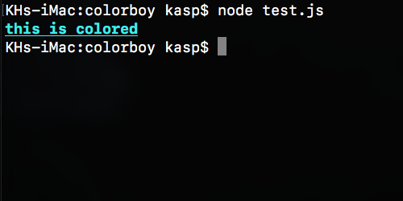
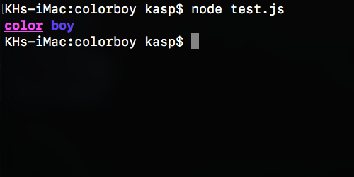

# colorboy
Easily add color to your `console.log`s in Node.js.

## Installation
```
npm install colorboy
```

## Usage
```js
require("colorboy").addDefaults();
console.log("Globgogabgalab".red);
console.log("Potato chips".cyan.underline.italic);
console.log("The Eden Project".color("#067CB6").bgColor(25, 25, 150).bold);
```


## Colors
Below you can see how to specify colors. To specify a background color, simply use `.bgColor()` instead of `.color()`.
- Colors added by `addDefaults()`:
    ```js
    'Sonic'.cyan
    ```
    Can be `red`, `black`, `green`, `yellow`, `blue`, `pink`, `cyan`, `white` or `gray`
- A [CSS keyword](https://www.w3.org/wiki/CSS/Properties/color/keywords): `'Sonic'.color('crimson')`
- A hex code:
    ```js
    'Sonic'.color('#FF00FF')
    ```
- An rgb code:
    ```js
    'Sonic'.color(220, 20, 60)
    ```
- An rgb code:
    ```js
    'Sonic'.color(220, 20, 60, 'rgb')
    ```
- An hsl code:
    ```js
    'Sonic'.color(32, 100, 100, 'hsl')
    ```
- An hsv code:
    ```js
    'Sonic'.color(32, 100, 50, 'hsv')
    ```
- An hwb code:
    ```js
    'Sonic'.color(32, 0, 50, 'hwb')
    ```

Passing arrays works too:
```js
// the following are equivalent:
'Sonic'.color(220, 20, 60)
'Sonic'.color([220, 20, 60])

// the following are equivalent:
'Sonic'.color(32, 100, 100, 'hsl')
'Sonic'.color([32, 100, 100, 'hsl'])
```

## Styles
Use styles added by `addDefaults()`:
```js
'Sonic'.bold
```
Can be `bold`, `dim`, `italic`, `underline`, `inverse` and `strikethrough`

When specifying custom styles, you can pass a string or an array of strings. These are the possible strings:
- `"bold"`
- `"dim"`
- `"italic"`
- `"underline"`
- `"inverse"`
- `"strikethrough"`
- `"reset"`
- `"hidden"`
- `"visible"`

## Custom colors & styles
```js
let currentBgColor = 'red';

require('./index.js')
  .addColor("crimson", {color:"crimson"})
  .addColor('greenish', {
    color: '#000000',
    bgColor: '#00FE7C',
    style: ['bold', 'italic'],
  })
  .addColorFunction('error', (color) => {
    return {
      color: color,
      bgColor: currentBgColor,
    }
  })
console.log('Custom:');
console.log('Unlike Pluto'.greenish);
console.log('Unlike Pluto'.error('white'));
currentBgColor = 'cyan'
console.log('Unlike Pluto'.error('black'));
```


### colorboy.addDefaults(functions = true, colors = true, styles = true)
Adds the default colorboy colors & styles. Takes three optional arguments, all true by default.
- `functions`: Whether to add the default functions prototypes (`color`, `bgColor` and `style`)
- `colors`: Whether to add the default colors prototypes (`red`, `green`, etc)
- `styles`: Whether to add the default styles prototypes (`bold`, `underline`, etc)

### colorboy.addColor(name, options)
Adds a color prototype.
- `name`: The prototype name
- `options`: A `color object` (see below)

### colorboy.addColorFunction(name, optionsCallback)
- `name`: The prototype name.
- `options`: A function that returns a `color object` (see below).

### color object
An object that defines colors and styles, in this format:
```
{
    color: COLOR,
    bgColor: COLOR,
    style: STYLE
}
```

## Dev instructions

### Get started
1. Install Node.js
2. Run `npm install`

To test, run:
```
npm run test
```

### Publish new version
1. Update CHANGELOG.md
2. Bump the version number, commit and tag:
    ```
    npm version <version>
    ```
3. Publish to npm:
    ```
    npm publish
    ```
4. Create GitHub release with release notes
